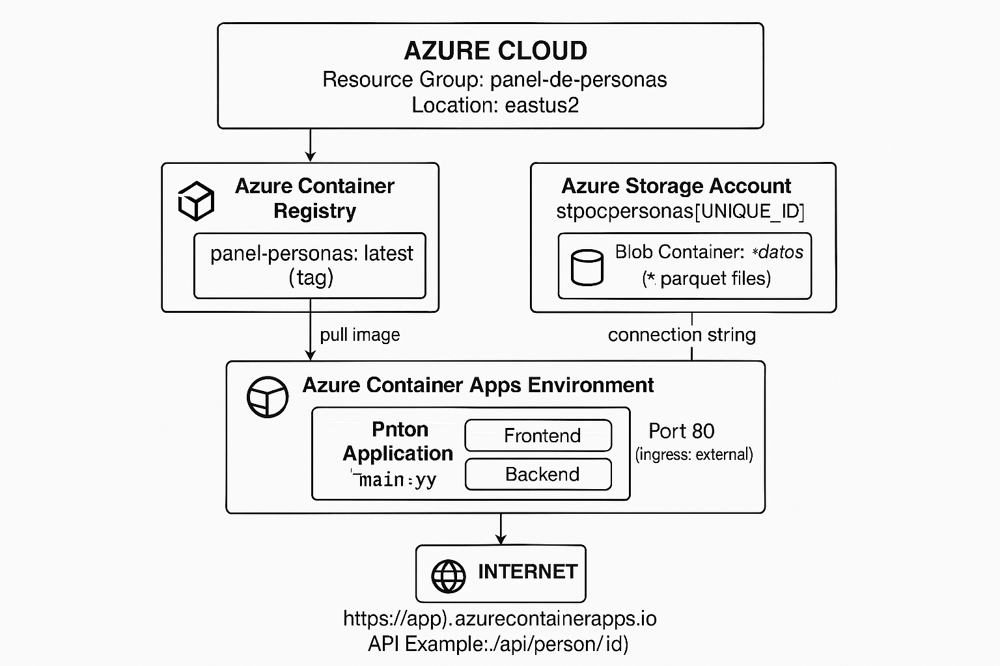

# Documento de Transferencia Tecnológica
## Panel de Personas CGR - Sistema Integrado de Información
### Versión 2.0

---

# 1. Resumen Ejecutivo

El **Panel de Personas CGR** es una aplicación web que permite consultar información consolidada de personas desde múltiples fuentes de datos. El sistema está desplegado en **Microsoft Azure** utilizando una arquitectura de contenedores serverless.

| Aspecto | Detalle |
|---------|---------|
| **Nombre** | Panel de Personas CGR |
| **Versión** | 2.0.0 |
| **Plataforma** | Azure Container Apps |
| **Lenguaje Backend** | Python 3.11 |
| **Framework Web** | Flask 3.0 |
| **Frontend** | HTML5/CSS3/JavaScript (Vanilla) |
| **Almacenamiento** | Azure Blob Storage (Parquet) |

---

# 2. Diagrama de Arquitectura General



**Componentes principales:**
- **Azure Container Registry**: Almacena las imágenes Docker del proyecto
- **Azure Storage Account**: Contiene los archivos Parquet con los datos
- **Azure Container Apps**: Ejecuta la aplicación web (serverless)
- **Internet**: Acceso público vía HTTPS

---

# 3. Stack Tecnológico

## 3.1 Lenguajes de Programación

| Lenguaje | Versión | Uso |
|----------|---------|-----|
| **Python** | 3.11+ | Backend, procesamiento de datos, API REST |
| **JavaScript** | ES6+ | Frontend, interactividad del usuario |
| **HTML5** | 5 | Estructura del frontend |
| **CSS3** | 3 | Estilos y diseño responsivo |
| **Bash** | - | Scripts de despliegue y automatización |

## 3.2 Frameworks y Librerías Backend

| Librería | Versión | Propósito |
|----------|---------|-----------|
| **Flask** | ≥3.0.0 | Framework web principal (API REST) |
| **Flask-CORS** | ≥4.0.0 | Manejo de Cross-Origin Resource Sharing |
| **Werkzeug** | ≥3.0.0 | Utilidades WSGI |
| **Gunicorn** | ≥21.0.0 | Servidor WSGI para producción |

## 3.3 Procesamiento de Datos

| Librería | Versión | Propósito |
|----------|---------|-----------|
| **Pandas** | ≥2.0.0 | Manipulación de datos tabulares |
| **Polars** | ≥1.0.0 | Procesamiento de datos de alto rendimiento |
| **PyArrow** | ≥15.0.0 | Lectura/escritura de archivos Parquet |
| **OpenPyXL** | ≥3.1.0 | Lectura de archivos Excel |

## 3.4 Integración con Azure

| Librería | Versión | Propósito |
|----------|---------|-----------|
| **azure-storage-blob** | ≥12.19.0 | Acceso a Azure Blob Storage |
| **azure-identity** | ≥1.15.0 | Autenticación con servicios Azure |

## 3.5 Utilidades

| Librería | Versión | Propósito |
|----------|---------|-----------|
| **python-dotenv** | ≥1.0.0 | Carga de variables de entorno desde .env |

## 3.6 Frontend

| Tecnología | Descripción |
|------------|-------------|
| **HTML5** | Estructura semántica, SPA single-file |
| **CSS3 Puro** | Estilos inline, sin frameworks (no Bootstrap, no Tailwind) |
| **CSS Custom Properties** | Variables CSS para theming y colores |
| **Vanilla JavaScript** | ES6+, sin frameworks (no React, no Vue, no jQuery) |
| **Google Fonts (CDN)** | Tipografías: DM Sans, JetBrains Mono |
| **Responsive Design** | Media queries nativas, adaptable a dispositivos |
| **Fetch API** | Llamadas HTTP nativas al backend |

> **Nota**: El frontend es un archivo HTML único (`index.html`) que contiene todo el CSS y JavaScript embebido, sin dependencias externas excepto las fuentes de Google.

---

# 4. Recursos de Azure

## 4.1 Inventario de Recursos

| Recurso | Nombre | SKU/Tier | Propósito |
|---------|--------|----------|-----------|
| **Resource Group** | `panel-de-personas` | - | Contenedor lógico de recursos |
| **Storage Account** | `stpocpersonas{ID}` | Standard_LRS | Almacenamiento de datos Parquet |
| **Container Registry** | `acrpocpersonas{ID}` | Basic | Registro de imágenes Docker |
| **Container Apps Environment** | `panel-env` | Consumption | Entorno de ejecución serverless |
| **Container App** | `panel-app` | Consumption | Aplicación web |

## 4.2 Diagrama de Recursos Azure

```
panel-de-personas (Resource Group)
│
├── stpocpersonas{ID} (Storage Account)
│   └── datos (Blob Container)
│       ├── personas.parquet
│       ├── relaciones_laborales.parquet
│       ├── documentos_ingresados.parquet
│       ├── sociedades.parquet
│       ├── sii_sociedades.parquet
│       ├── sii_rentas.parquet
│       ├── srcei_condenas.parquet
│       ├── srcei_inhabilidades.parquet
│       ├── srcei_deudores.parquet
│       ├── srcei_hijos.parquet
│       └── sistradoc_denuncias.parquet
│
├── acrpocpersonas{ID} (Container Registry)
│   └── panel-personas:latest
│       └── panel-personas:v{timestamp}
│
└── panel-env (Container Apps Environment)
    └── panel-app (Container App)
        └── [Docker Container con la aplicación]
```

## 4.3 Configuración de Secretos

| Variable de Entorno | Tipo | Descripción |
|---------------------|------|-------------|
| `AZURE_STORAGE_CONNECTION_STRING` | Secret | Cadena de conexión al Storage Account |
| `DEPLOY_VERSION` | Env Var | Tag de la versión desplegada |

---

# 5. Estructura del Proyecto

```
MPV0-panel de personas/
│
├── main.py                    # Punto de entrada principal
├── pyproject.toml             # Configuración del proyecto Python
├── Dockerfile                 # Definición de imagen Docker
├── .env                       # Variables de entorno (no versionado)
│
├── backend/
│   ├── __init__.py
│   ├── app.py                 # Aplicación Flask principal
│   ├── utils/
│   │   ├── __init__.py
│   │   └── rut_validator.py   # Validador de RUT chileno
│   └── tests/
│       ├── __init__.py
│       ├── test_api_integration.py
│       └── test_data_loading.py
│
├── frontend/
│   ├── index.html             # Aplicación SPA principal
│   └── debug.html             # Herramienta de debugging
│
├── datos/
│   └── parquet/               # Archivos Parquet locales (desarrollo)
│       └── *.parquet
│
└── deploy/
    ├── setup_azure.sh         # Script de configuración inicial Azure
    └── deploy.sh              # Script de despliegue continuo
```

---

# 6. Arquitectura de la Aplicación

## 6.1 Componentes Principales

```
┌──────────────────────────────────────────────────────────────────┐
│                         FRONTEND                                  │
│                       (index.html)                                │
│  ┌────────────────────────────────────────────────────────────┐  │
│  │  • Interfaz de usuario responsive                          │  │
│  │  • Búsqueda por RUT                                        │  │
│  │  • Visualización de datos en pestañas                      │  │
│  │  • Exportación de datos                                    │  │
│  └────────────────────────────────────────────────────────────┘  │
└─────────────────────────────┬────────────────────────────────────┘
                              │ HTTP/REST
                              ▼
┌──────────────────────────────────────────────────────────────────┐
│                          BACKEND                                  │
│                    (Flask API - app.py)                          │
│  ┌────────────────────────────────────────────────────────────┐  │
│  │  Endpoints:                                                 │  │
│  │  • GET /                    → Sirve frontend                │  │
│  │  • GET /api/person/{rut}    → Consulta datos de persona    │  │
│  │  • GET /api/health          → Health check                  │  │
│  └────────────────────────────────────────────────────────────┘  │
│  ┌────────────────────────────────────────────────────────────┐  │
│  │  Servicios:                                                 │  │
│  │  • PanelPersonasAPI         → Clase principal de negocio   │  │
│  │  • RutValidator             → Validación de RUT chileno    │  │
│  └────────────────────────────────────────────────────────────┘  │
└─────────────────────────────┬────────────────────────────────────┘
                              │ Azure SDK
                              ▼
┌──────────────────────────────────────────────────────────────────┐
│                      CAPA DE DATOS                                │
│  ┌────────────────────────────────────────────────────────────┐  │
│  │  Azure Blob Storage          │    Local (desarrollo)       │  │
│  │  ┌─────────────────────┐     │    ┌─────────────────────┐  │  │
│  │  │  *.parquet files    │     │    │  datos/parquet/     │  │  │
│  │  │  (Polars + PyArrow) │     │    │  *.parquet          │  │  │
│  │  └─────────────────────┘     │    └─────────────────────┘  │  │
│  └────────────────────────────────────────────────────────────┘  │
└──────────────────────────────────────────────────────────────────┘
```

## 6.2 Flujo de Datos

```
┌─────────┐    ┌─────────────┐    ┌─────────────┐    ┌─────────────┐
│ Usuario │───▶│  Frontend   │───▶│   Flask     │───▶│   Azure     │
│         │    │  (Browser)  │    │   API       │    │   Blob      │
└─────────┘    └─────────────┘    └─────────────┘    └─────────────┘
     │               │                   │                   │
     │  1. Ingresa   │                   │                   │
     │     RUT       │                   │                   │
     │               │  2. GET /api/     │                   │
     │               │     person/{rut}  │                   │
     │               │──────────────────▶│                   │
     │               │                   │  3. Query         │
     │               │                   │     DataFrames    │
     │               │                   │◀──────────────────│
     │               │                   │                   │
     │               │  4. JSON Response │                   │
     │               │◀──────────────────│                   │
     │  5. Muestra   │                   │                   │
     │     datos     │                   │                   │
     │◀──────────────│                   │                   │
```

---

# 7. Procesos de Despliegue

## 7.1 Setup Inicial (setup_azure.sh)

Este script se ejecuta **una sola vez** para crear la infraestructura en Azure.

```
┌─────────────────────────────────────────────────────────────────┐
│                    SETUP INICIAL                                 │
│                  (setup_azure.sh)                                │
└─────────────────────────────────────────────────────────────────┘
                              │
                              ▼
┌─────────────────────────────────────────────────────────────────┐
│ 1. LIMPIEZA                                                      │
│    • Eliminar Container App existente                           │
│    • Eliminar Container Apps Environment existente              │
└─────────────────────────────────────────────────────────────────┘
                              │
                              ▼
┌─────────────────────────────────────────────────────────────────┐
│ 2. CREAR STORAGE                                                 │
│    • az storage account create                                  │
│    • az storage container create (nombre: "datos")              │
│    • az storage blob upload-batch (archivos .parquet)           │
└─────────────────────────────────────────────────────────────────┘
                              │
                              ▼
┌─────────────────────────────────────────────────────────────────┐
│ 3. CREAR CONTAINER REGISTRY                                      │
│    • az acr create --sku Basic --admin-enabled true             │
└─────────────────────────────────────────────────────────────────┘
                              │
                              ▼
┌─────────────────────────────────────────────────────────────────┐
│ 4. CREAR CONTAINER APPS ENVIRONMENT                              │
│    • az containerapp env create                                 │
│    • Esperar hasta estado "Succeeded"                           │
└─────────────────────────────────────────────────────────────────┘
                              │
                              ▼
┌─────────────────────────────────────────────────────────────────┐
│ 5. CREAR CONTAINER APP                                           │
│    • az containerapp create                                     │
│    • Configurar ingress externo (puerto 80)                     │
│    • Configurar secretos (connection string)                    │
│    • Configurar variables de entorno                            │
└─────────────────────────────────────────────────────────────────┘
```

### Comandos Azure CLI utilizados:

```bash
# Crear Storage Account
az storage account create \
  --name $STORAGE_ACCOUNT_NAME \
  --resource-group $RESOURCE_GROUP \
  --location $LOCATION \
  --sku Standard_LRS

# Crear Container de Blobs
az storage container create \
  --name datos \
  --account-name $STORAGE_ACCOUNT_NAME

# Subir archivos Parquet
az storage blob upload-batch \
  --account-name $STORAGE_ACCOUNT_NAME \
  --destination datos \
  --source ../datos/parquet \
  --pattern "*.parquet"

# Crear Container Registry
az acr create \
  --name $ACR_NAME \
  --resource-group $RESOURCE_GROUP \
  --sku Basic \
  --admin-enabled true

# Crear Container Apps Environment
az containerapp env create \
  --name panel-env \
  --resource-group $RESOURCE_GROUP \
  --location $LOCATION

# Crear Container App
az containerapp create \
  --name panel-app \
  --resource-group $RESOURCE_GROUP \
  --environment panel-env \
  --ingress external \
  --target-port 80 \
  --secrets "storage-connection-string=$CONNECTION_STRING" \
  --env-vars "AZURE_STORAGE_CONNECTION_STRING=secretref:storage-connection-string"
```

## 7.2 Despliegue Continuo (deploy.sh)

Este script se ejecuta cada vez que hay cambios en la aplicación.

```
┌─────────────────────────────────────────────────────────────────┐
│                    DESPLIEGUE CONTINUO                           │
│                      (deploy.sh)                                 │
└─────────────────────────────────────────────────────────────────┘
                              │
                              ▼
┌─────────────────────────────────────────────────────────────────┐
│ PASO 1/5: VERIFICAR SESIÓN AZURE                                 │
│    • az account show                                            │
│    • az login (si es necesario)                                 │
└─────────────────────────────────────────────────────────────────┘
                              │
                              ▼
┌─────────────────────────────────────────────────────────────────┐
│ PASO 2/5: OBTENER CONFIGURACIÓN                                  │
│    • Obtener nombre del ACR                                     │
│    • Generar tag de imagen (v{timestamp})                       │
└─────────────────────────────────────────────────────────────────┘
                              │
                              ▼
┌─────────────────────────────────────────────────────────────────┐
│ PASO 3/5: PREPARAR ARCHIVOS                                      │
│    • Copiar a directorio temporal:                              │
│      - backend/                                                 │
│      - frontend/                                                │
│      - main.py                                                  │
│      - pyproject.toml                                           │
│      - Dockerfile                                               │
└─────────────────────────────────────────────────────────────────┘
                              │
                              ▼
┌─────────────────────────────────────────────────────────────────┐
│ PASO 4/5: BUILD EN AZURE                                         │
│    • az acr build                                               │
│    • Esperar finalización (máx 120s)                            │
│    • Verificar estado: Succeeded/Failed                         │
└─────────────────────────────────────────────────────────────────┘
                              │
                              ▼
┌─────────────────────────────────────────────────────────────────┐
│ PASO 5/5: ACTUALIZAR CONTAINER APP                               │
│    • az containerapp update                                     │
│    • Actualizar imagen                                          │
│    • Actualizar variable DEPLOY_VERSION                         │
│    • Obtener URL pública                                        │
└─────────────────────────────────────────────────────────────────┘
```

---

# 8. Dockerfile

```dockerfile
# Imagen base
FROM python:3.11-slim

# Metadatos
LABEL maintainer="CDIA CGR <cdia@contraloria.cl>"
LABEL version="2.0"

# Variables de entorno
ENV PYTHONUNBUFFERED=1 \
    PYTHONDONTWRITEBYTECODE=1 \
    PORT=8081

WORKDIR /app

# Dependencias del sistema
RUN apt-get update && apt-get install -y --no-install-recommends \
    gcc curl && rm -rf /var/lib/apt/lists/*

# Instalar dependencias Python
COPY pyproject.toml ./
RUN pip install .

# Copiar código
COPY backend/ ./backend/
COPY frontend/ ./frontend/
COPY main.py ./

# Usuario no-root (seguridad)
RUN useradd --create-home appuser && chown -R appuser:appuser /app
USER appuser

EXPOSE 8081

# Health check
HEALTHCHECK --interval=30s --timeout=10s --retries=3 \
    CMD curl -f http://localhost:8081/ || exit 1

# Comando de inicio
CMD ["python", "main.py", "api", "--host", "0.0.0.0", "--port", "8081"]
```

---

# 9. Fuentes de Datos

El sistema consolida información de múltiples fuentes:

| Archivo Parquet | Fuente | Contenido |
|-----------------|--------|-----------|
| `personas.parquet` | CGR | Datos básicos de personas |
| `relaciones_laborales.parquet` | CGR | Historial laboral en el Estado |
| `documentos_ingresados.parquet` | CGR | Documentos ingresados a CGR |
| `sociedades.parquet` | CGR | Participación en sociedades |
| `sii_sociedades.parquet` | SII | Sociedades registradas en SII |
| `sii_rentas.parquet` | SII | Información de rentas |
| `srcei_condenas.parquet` | SRCEI | Condenas registradas |
| `srcei_inhabilidades.parquet` | SRCEI | Inhabilidades |
| `srcei_deudores.parquet` | SRCEI | Registro de deudores |
| `srcei_hijos.parquet` | SRCEI | Información de hijos |
| `sistradoc_denuncias.parquet` | SISTRADOC | Denuncias registradas |

---

# 10. Seguridad

## 10.1 Medidas Implementadas

| Área | Medida |
|------|--------|
| **Contenedor** | Usuario no-root (`appuser`) |
| **Secretos** | Almacenados en Azure Container Apps Secrets |
| **Red** | Ingress externo con HTTPS automático |
| **Autenticación Azure** | Connection strings en secretos |
| **CORS** | Configurado para orígenes específicos |

## 10.2 Variables Sensibles

Las siguientes variables **NO** deben exponerse en código:
- `AZURE_STORAGE_CONNECTION_STRING`

---

# 11. Desarrollo Local

## 11.1 Requisitos

- Python 3.11+
- pip
- Archivos `.parquet` en `datos/parquet/`

## 11.2 Instalación

```bash
# Crear entorno virtual
python -m venv .venv

# Activar entorno
# Windows:
.venv\Scripts\activate
# Linux/Mac:
source .venv/bin/activate

# Instalar dependencias
pip install -e .
```

## 11.3 Ejecución

```bash
# Iniciar servidor local
python main.py api --port 8081 --debug

# Acceder a:
# http://localhost:8081
```

---

# 12. Comandos Útiles

## 12.1 Azure CLI

```bash
# Login a Azure
az login

# Ver recursos del grupo
az resource list --resource-group panel-de-personas -o table

# Ver logs de la aplicación
az containerapp logs show --name panel-app --resource-group panel-de-personas

# Reiniciar aplicación
az containerapp revision restart --name panel-app --resource-group panel-de-personas

# Ver URL de la aplicación
az containerapp show --name panel-app --resource-group panel-de-personas \
  --query "properties.configuration.ingress.fqdn" -o tsv
```

## 12.2 Docker (local)

```bash
# Construir imagen
docker build -t panel-personas:local .

# Ejecutar localmente
docker run -p 8081:8081 \
  -e AZURE_STORAGE_CONNECTION_STRING="..." \
  panel-personas:local
```

---

# 13. Historial de Versiones

| Versión | Fecha | Cambios |
|---------|-------|---------|
| 2.0.0 | 2024 | Migración a Azure Container Apps, nuevo frontend |
| 1.0.0 | - | Versión inicial |

---

*Documento generado para transferencia tecnológica del Panel de Personas CGR*
