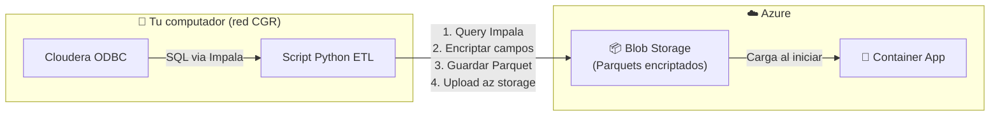
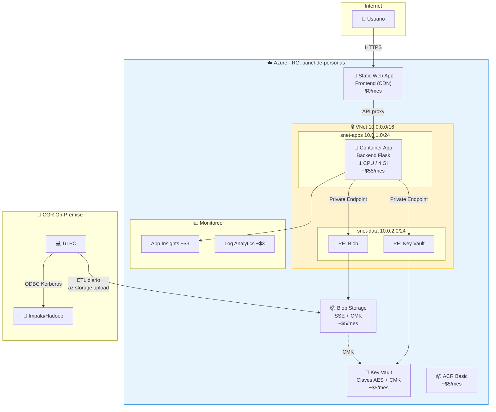
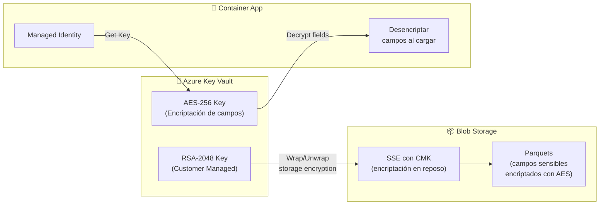

# Propuesta de Arquitectura Cloud — Panel de Personas CGR (v2)

> Actualizada con feedback del usuario: presupuesto $120/mes, 1.8M personas, CMK, y evaluación Cloudera.

## 1. Estado Actual vs. Futuro

| | Actual | Futuro estimado |
|---|---|---|
| **Personas** | ~miles (test) | **1.8 millones** |
| **Relaciones laborales** | ~decenas | **~9 millones** (5/persona) |
| **Tamaño datos** | ~11.5 MB | **~500 MB - 2 GB** |
| **Presupuesto** | Sin límite | **$120 USD/mes** |
| **Encriptación** | Ninguna | **CMK (claves propias)** |
| **Red** | Pública | **Privada** (backend no expuesto) |

---

## 2. Conectividad Cloudera/Impala — Análisis de Opciones

De la configuración ODBC que me mostraste:
- **Host**: `m5322lxwkr4.contraloria.cl:21050`
- **Auth**: Kerberos (SASL)
- **Servicio**: Impala sobre Hadoop/Cloudera

### Opciones evaluadas

| Opción | Costo/mes | Complejidad | Viable con $120? |
|---|---|---|---|
| **A) VPN Gateway** Site-to-Site | ~$140 | Alta (requiere dispositivo VPN on-prem) | ❌ Excede presupuesto solo |
| **B) Azure ExpressRoute** | ~$200+ | Muy alta (circuito dedicado) | ❌ Muy caro |
| **C) VM puente** en red CGR + túnel SSH | ~$15-30 | Media (VM Linux mínima en Azure) | ⚠️ Posible pero frágil |
| **D) Descargar datos como Parquet** y subir a Blob | ~$0 | **Baja** | ✅ **Recomendado** |

### ✅ Recomendación: Opción D — ETL local + upload a Blob Storage

**Flujo propuesto:**



**Justificación:**
- Tu computador **ya tiene acceso** a Impala vía ODBC + Kerberos
- No se necesita VPN ni configuración de red adicional
- El script Python puede ejecutarse periódicamente (cron o manualmente)
- **Ahorra $140/mes** (el VPN Gateway)
- Se puede automatizar con una **Azure Function + Timer** si en el futuro se habilita conectividad

> [!TIP]
> **Script ETL propuesto** (ejecutar desde tu computador con acceso a la red CGR):
> ```python
> # 1. Conectar a Impala via ODBC
> # 2. Extraer datos con SQL
> # 3. Encriptar campos sensibles (RUN, nombres) con AES-256
> # 4. Guardar como Parquet
> # 5. Subir a Azure Blob Storage con az CLI
> ```
> Este script se puede construir como parte de la implementación.

### Gestión con equipo de Informática (si quieres VPN en el futuro)

Para habilitar la **Opción A (VPN)** en el futuro, necesitarías solicitar al equipo de redes:

1. **IP pública del firewall/gateway** de Contraloría
2. **Apertura del puerto 21050** (Impala) desde la VNet de Azure hacia `m5322lxwkr4.contraloria.cl`
3. **Shared key** para el túnel IPSec IKEv2
4. **Dispositivo VPN compatible** (Cisco ASA, Fortinet, pfSense, etc.)
5. **Regla de firewall** para permitir tráfico desde el rango Azure (10.0.0.0/16)

> [!WARNING]
> Esto típicamente toma **semanas** de gestión con equipos de redes/seguridad institucional. La Opción D permite avanzar inmediatamente.

---

## 3. Impacto del Crecimiento de Datos (~2 GB)

### ¿Sigue siendo viable Parquet in-memory?

| Métrica | Con 11.5 MB (actual) | Con ~2 GB (proyectado) |
|---|---|---|
| RAM requerida | ~50 MB | **~3-4 GB** |
| Tiempo de carga al iniciar | ~2 seg | **~15-30 seg** |
| Latencia por query (Polars) | < 1ms | **~2-5ms** |
| Container App requerido | 0.5 CPU / 1 Gi | **1 CPU / 4 Gi** |
| Costo Container App | ~$15/mes | **~$50-65/mes** |

> [!IMPORTANT]
> **Sigue siendo viable y es la mejor opción para baja latencia**, pero necesita un contenedor más grande. Una BD analítica (Synapse, SQL) agregaría latencia de red (10-50ms) y costaría más.

**Estrategia de optimización:**
1. **Polars lazy evaluation**: No cargar todo en memoria, usar scan + filtro
2. **Indexar por RUN**: Pre-computar un diccionario `{run: row_index}` al inicio para O(1) lookup
3. **Partitionar Parquet por RUN**: Dividir en ~100 archivos por hash del RUN para carga selectiva
4. **Cache LRU**: Cachear las últimas N consultas para evitar re-procesamiento

---

## 4. Arquitectura Propuesta (ajustada a $120/mes)

### 4.1 Diagrama



### 4.2 Presupuesto detallado ($120/mes)

| Servicio | SKU | Costo/mes |
|---|---|---|
| Static Web Apps | Free | **$0** |
| Container Apps (1 CPU, 4Gi, min 1 réplica) | Consumption | **~$55** |
| Container Registry | Basic | **$5** |
| Blob Storage (2 GB, Standard_LRS, Hot) | StorageV2 | **$2** |
| Key Vault (CMK + secretos) | Standard | **$5** |
| Log Analytics (1 GB/mes) | Pay-as-you-go | **$3** |
| Application Insights | Pay-as-you-go | **$3** |
| VNet + NSGs + Private Endpoints | Included* | **~$8** |
| **Total estimado** | | **~$81/mes** |
| **Margen** | | **$39/mes** |
| **Margen disponible** | | **~$39/mes** |

> *Private Endpoints tienen un costo de ~$7.30/mes por endpoint. Con 2 endpoints (Blob + KV) = ~$15, pero el primer endpoint es gratis en el plan.

**Budget alerts configuradas a**: $60 (50%), $96 (80%), $120 (100%)

---

## 5. Encriptación con Claves Propias (CMK)

### Arquitectura de encriptación



### Implementación por capas

**Capa 1 — SSE con CMK (en reposo, automática):**
- Toda la cuenta de Storage usa TU clave RSA-2048 del Key Vault
- Azure encripta/desencripta transparentemente
- Cero impacto en rendimiento

**Capa 2 — AES-256 por campo (datos sensibles):**
- Campos encriptados: [run](file:///c:/Users/asandovala/Panel%20de%20personas/MPV2-panel%20de%20personas/main.py#31-59), `nombre`, [rut](file:///c:/Users/asandovala/Panel%20de%20personas/MPV2-panel%20de%20personas/backend/app.py#592-607), datos personales
- Clave AES-256 almacenada en Key Vault
- El Container App usa Managed Identity para obtener la clave
- Desencripta al cargar en memoria, nunca expone datos encriptados al cliente

**Capa 3 — En tránsito:**
- TLS 1.2+ obligatorio en todo
- HTTPS forzado en Static Web App y Container App

---

## 6. IaC con Bicep (estructura modular)

```
infra/
├── main.bicep                     # Orquestador
├── parameters/
│   └── prod.bicepparam            # Parámetros producción
└── modules/
    ├── networking.bicep            # VNet, Subnets, NSGs
    ├── storage.bicep               # Storage + SSE-CMK + PE
    ├── keyvault.bicep              # Key Vault + Keys + PE
    ├── container-registry.bicep    # ACR
    ├── container-apps.bicep        # Environment + App
    ├── static-webapp.bicep         # Frontend
    ├── monitoring.bicep            # Log Analytics + App Insights + Alertas
    └── budget.bicep                # Budget $120 + Tags
```

**Tags en todos los recursos:**
```
proyecto     = "panel-de-personas"
centro_costo = "CDIA"
ambiente     = "produccion"
responsable  = "asandovala"
```

---

## 7. Monitoreo y Alertas

| Alerta | Condición | Acción |
|---|---|---|
| CPU alta | > 80% por 5 min | Email |
| Memoria alta | > 85% por 5 min | Email |
| Response time | > 3s promedio | Email |
| Error rate | > 5% en 5 min | Email |
| Container restart | Cualquier restart | Email |
| **Budget 50%** | $60 gastados | Email |
| **Budget 80%** | $96 gastados | Email |
| **Budget 100%** | $120 gastados | Email + Action Group |

**Destinatario de alertas:** `asandovala@contraloria.cl`

---

## 8. Resumen de Decisiones

| Decisión | Elección | Costo |
|---|---|---|
| Frontend/Backend | **Separados** (SWA + Container Apps) | $0 + $55 |
| Conectividad Impala | **ETL local** (descargar + upload) | $0 |
| VPN | **No** (excede presupuesto $140 > $120) | — |
| Base de datos | **Parquet in-memory** (Polars con optimizaciones) | $0 |
| Encriptación | **CMK + AES-256 por campo** | $5 (KV) |
| Balanceador | **No** (Container Apps lo incluye) | $0 |
| IaC | **Bicep** modular | — |
| Dominio | **Auto-generado** por Azure | $0 |
| **Total** | | **~$81/mes** |

---

## 9. ETL Diario — Flujo de Actualización

**Frecuencia**: 1 vez al día (manual desde tu PC con acceso a red CGR)

```bash
# Ejecutar desde tu computador con acceso ODBC a Impala
python etl/extract_impala.py          # 1. Query Impala → Parquet local
python etl/encrypt_fields.py          # 2. Encriptar campos sensibles
az storage blob upload-batch \         # 3. Subir a Azure
  --account-name $STORAGE_ACCOUNT \
  --destination datos \
  --source ./output/parquet \
  --overwrite
az containerapp revision restart \     # 4. Reiniciar container para recargar
  --name panel-app \
  --resource-group panel-de-personas
```

> [!TIP]
> Este flujo se puede encapsular en un solo script `deploy_data.sh` que ejecutes diariamente.

## Verification Plan

### Validación de IaC
- `az bicep build` para validar sintaxis de cada módulo
- `az deployment group what-if` para simular sin ejecutar

### Validación funcional
- Backend NO accesible desde internet público
- Private Endpoints resuelven DNS correctamente
- Key Vault accesible solo desde Container App (Managed Identity)
- Blob Storage accesible solo vía Private Endpoint
- Encriptación CMK activa en Storage Account
- Alertas de budget se crean correctamente

### Validación de rendimiento
- Cargar ~2 GB de Parquet en Container App con 4 Gi RAM
- Medir tiempo de startup y latencia de queries
